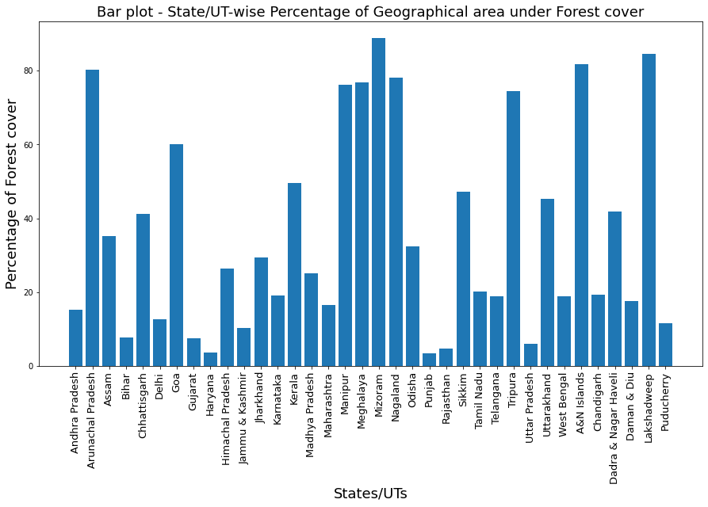

### Research Methods - Assignment 1 - Plots

Data for Scatter plot is downloaded from https://data.gov.in/resources/stateut-wise-forest-cover-india-state-forest-report-isfr-during-2015from-ministry

The data gives the State/UT-wise Forest cover as per India State of Forest Report (ISFR) during 2015(From : Ministry of Environment, Forest and Climate Change)

<table border="1" class="dataframe">
  <thead>
    <tr style="text-align: right;">
      <th></th>
      <th>States/UTs</th>
      <th>Geographical Area</th>
      <th>Total Forest Cover 2015</th>
      <th>Percentage of geographical area</th>
    </tr>
  </thead>
  <tbody>
    <tr>
      <th>0</th>
      <td>Andhra Pradesh</td>
      <td>160204</td>
      <td>24424.00</td>
      <td>15.25</td>
    </tr>
    <tr>
      <th>1</th>
      <td>Arunachal Pradesh</td>
      <td>83743</td>
      <td>67248.00</td>
      <td>80.30</td>
    </tr>
    <tr>
      <th>2</th>
      <td>Assam</td>
      <td>78438</td>
      <td>27623.00</td>
      <td>35.22</td>
    </tr>
    <tr>
      <th>3</th>
      <td>Bihar</td>
      <td>94163</td>
      <td>7288.00</td>
      <td>7.74</td>
    </tr>
    <tr>
      <th>4</th>
      <td>Chhattisgarh</td>
      <td>135191</td>
      <td>55586.00</td>
      <td>41.12</td>
    </tr>
    <tr>
      <th>5</th>
      <td>Delhi</td>
      <td>1483</td>
      <td>189.00</td>
      <td>12.73</td>
    </tr>
    <tr>
      <th>6</th>
      <td>Goa</td>
      <td>3702</td>
      <td>2224.00</td>
      <td>60.08</td>
    </tr>
    <tr>
      <th>7</th>
      <td>Gujarat</td>
      <td>196022</td>
      <td>14660.00</td>
      <td>7.48</td>
    </tr>
    <tr>
      <th>8</th>
      <td>Haryana</td>
      <td>44212</td>
      <td>1584.00</td>
      <td>3.58</td>
    </tr>
    <tr>
      <th>9</th>
      <td>Himachal Pradesh</td>
      <td>55673</td>
      <td>14696.00</td>
      <td>26.40</td>
    </tr>
    <tr>
      <th>10</th>
      <td>Jammu &amp; Kashmir</td>
      <td>222236</td>
      <td>22988.00</td>
      <td>10.34</td>
    </tr>
    <tr>
      <th>11</th>
      <td>Jharkhand</td>
      <td>79714</td>
      <td>23478.00</td>
      <td>29.45</td>
    </tr>
    <tr>
      <th>12</th>
      <td>Karnataka</td>
      <td>191791</td>
      <td>36421.00</td>
      <td>18.99</td>
    </tr>
    <tr>
      <th>13</th>
      <td>Kerala</td>
      <td>38863</td>
      <td>19239.00</td>
      <td>49.50</td>
    </tr>
    <tr>
      <th>14</th>
      <td>Madhya Pradesh</td>
      <td>308245</td>
      <td>77462.00</td>
      <td>25.13</td>
    </tr>
    <tr>
      <th>15</th>
      <td>Maharashtra</td>
      <td>307713</td>
      <td>50628.00</td>
      <td>16.45</td>
    </tr>
    <tr>
      <th>16</th>
      <td>Manipur</td>
      <td>22327</td>
      <td>16994.00</td>
      <td>76.11</td>
    </tr>
    <tr>
      <th>17</th>
      <td>Meghalaya</td>
      <td>22429</td>
      <td>17217.00</td>
      <td>76.76</td>
    </tr>
    <tr>
      <th>18</th>
      <td>Mizoram</td>
      <td>21081</td>
      <td>18748.00</td>
      <td>88.93</td>
    </tr>
    <tr>
      <th>19</th>
      <td>Nagaland</td>
      <td>16579</td>
      <td>12966.00</td>
      <td>78.21</td>
    </tr>
    <tr>
      <th>20</th>
      <td>Odisha</td>
      <td>155707</td>
      <td>50354.00</td>
      <td>32.34</td>
    </tr>
    <tr>
      <th>21</th>
      <td>Punjab</td>
      <td>50362</td>
      <td>1771.00</td>
      <td>3.52</td>
    </tr>
    <tr>
      <th>22</th>
      <td>Rajasthan</td>
      <td>342239</td>
      <td>16171.00</td>
      <td>4.73</td>
    </tr>
    <tr>
      <th>23</th>
      <td>Sikkim</td>
      <td>7096</td>
      <td>3357.00</td>
      <td>47.31</td>
    </tr>
    <tr>
      <th>24</th>
      <td>Tamil Nadu</td>
      <td>130058</td>
      <td>26345.00</td>
      <td>20.26</td>
    </tr>
    <tr>
      <th>25</th>
      <td>Telangana</td>
      <td>114865</td>
      <td>21591.00</td>
      <td>18.80</td>
    </tr>
    <tr>
      <th>26</th>
      <td>Tripura</td>
      <td>10486</td>
      <td>7811.00</td>
      <td>74.49</td>
    </tr>
    <tr>
      <th>27</th>
      <td>Uttar Pradesh</td>
      <td>240928</td>
      <td>14461.00</td>
      <td>6.00</td>
    </tr>
    <tr>
      <th>28</th>
      <td>Uttarakhand</td>
      <td>53483</td>
      <td>24240.00</td>
      <td>45.32</td>
    </tr>
    <tr>
      <th>29</th>
      <td>West Bengal</td>
      <td>88752</td>
      <td>16828.00</td>
      <td>18.96</td>
    </tr>
    <tr>
      <th>30</th>
      <td>A&amp;N Islands</td>
      <td>8249</td>
      <td>6751.00</td>
      <td>81.84</td>
    </tr>
    <tr>
      <th>31</th>
      <td>Chandigarh</td>
      <td>114</td>
      <td>22.03</td>
      <td>19.32</td>
    </tr>
    <tr>
      <th>32</th>
      <td>Dadra &amp; Nagar Haveli</td>
      <td>491</td>
      <td>206.00</td>
      <td>41.96</td>
    </tr>
    <tr>
      <th>33</th>
      <td>Daman &amp; Diu</td>
      <td>112</td>
      <td>19.61</td>
      <td>17.51</td>
    </tr>
    <tr>
      <th>34</th>
      <td>Lakshadweep</td>
      <td>32</td>
      <td>27.06</td>
      <td>84.56</td>
    </tr>
    <tr>
      <th>35</th>
      <td>Puducherry</td>
      <td>480</td>
      <td>55.38</td>
      <td>11.54</td>
    </tr>
  </tbody>
</table>

Here the independent variables are the states and the dependent variables are the Geographical area, Total forest cover and percentage of area under forest cover.
Since the independent variables or the states are not related to each other, to analyse this type of data Scatter plot can be used with X axis as the states and Y axis as the dependent variables.
To do an analysis, we plot both the Total geographical area and the forest cover in a state using Blue and Red color as shown in below plot.

#### Conclusion-The lesser the gap between the Geographical area and the forest cover for a state, the more is the percentage of forest in that state.

## a. Scatter Plot

The percentage column also shows the percentage of forest cover each state has. Using a Bar graph we can visualise that.
#### Conclusion- The observation from Scatter plot is going in accordance with the Bar plot result. Thus the percentage we could effectively deduce without using the third data column of percentage

## Bar plot

Data for Box Plot and Line plot downloaded from https://data.gov.in/catalog/all-india-area-weighted-monthly-seasonal-and-annual-rainfall-mm?filters%5Bfield_catalog_reference%5D=85825&format=json&offset=0&limit=6&sort%5Bcreated%5D=desc

The data gives the All India Monthly Seasonal And Annual Rainfall in mm from 1901 to 2014

<table border="1" class="dataframe">
  <thead>
    <tr style="text-align: right;">
      <th></th>
      <th>YEAR</th>
      <th>JAN</th>
      <th>FEB</th>
      <th>MAR</th>
      <th>APR</th>
      <th>MAY</th>
      <th>JUN</th>
      <th>JUL</th>
      <th>AUG</th>
      <th>SEP</th>
      <th>OCT</th>
      <th>NOV</th>
      <th>DEC</th>
      <th>ANN</th>
      <th>Jan-Feb</th>
      <th>Mar-May</th>
      <th>Jun-Sep</th>
      <th>Oct-Dec</th>
    </tr>
  </thead>
  <tbody>
    <tr>
      <th>0</th>
      <td>1901</td>
      <td>34.7</td>
      <td>38.6</td>
      <td>17.8</td>
      <td>38.9</td>
      <td>50.6</td>
      <td>113.2</td>
      <td>241.4</td>
      <td>271.6</td>
      <td>124.7</td>
      <td>52.4</td>
      <td>38.7</td>
      <td>8.2</td>
      <td>1030.8</td>
      <td>73.2</td>
      <td>107.3</td>
      <td>751.0</td>
      <td>99.3</td>
    </tr>
    <tr>
      <th>1</th>
      <td>1902</td>
      <td>7.4</td>
      <td>4.2</td>
      <td>19.0</td>
      <td>44.1</td>
      <td>48.8</td>
      <td>111.7</td>
      <td>284.9</td>
      <td>201.0</td>
      <td>200.2</td>
      <td>62.5</td>
      <td>29.4</td>
      <td>25.2</td>
      <td>1038.4</td>
      <td>11.6</td>
      <td>111.9</td>
      <td>797.8</td>
      <td>117.2</td>
    </tr>
    <tr>
      <th>2</th>
      <td>1903</td>
      <td>16.7</td>
      <td>8.0</td>
      <td>31.1</td>
      <td>17.1</td>
      <td>59.5</td>
      <td>120.3</td>
      <td>293.2</td>
      <td>274.0</td>
      <td>198.1</td>
      <td>119.5</td>
      <td>40.3</td>
      <td>18.0</td>
      <td>1195.9</td>
      <td>24.7</td>
      <td>107.7</td>
      <td>885.6</td>
      <td>177.8</td>
    </tr>
    <tr>
      <th>3</th>
      <td>1904</td>
      <td>14.9</td>
      <td>9.7</td>
      <td>31.4</td>
      <td>33.7</td>
      <td>73.8</td>
      <td>165.5</td>
      <td>260.3</td>
      <td>207.7</td>
      <td>130.8</td>
      <td>69.8</td>
      <td>11.2</td>
      <td>16.4</td>
      <td>1025.1</td>
      <td>24.5</td>
      <td>138.8</td>
      <td>764.3</td>
      <td>97.4</td>
    </tr>
    <tr>
      <th>4</th>
      <td>1905</td>
      <td>24.7</td>
      <td>20.3</td>
      <td>41.8</td>
      <td>33.8</td>
      <td>55.8</td>
      <td>93.7</td>
      <td>253.0</td>
      <td>201.7</td>
      <td>178.1</td>
      <td>54.9</td>
      <td>9.6</td>
      <td>10.1</td>
      <td>977.5</td>
      <td>45.0</td>
      <td>131.4</td>
      <td>726.4</td>
      <td>74.7</td>
    </tr>
    <tr>
      <th>...</th>
      <td>...</td>
      <td>...</td>
      <td>...</td>
      <td>...</td>
      <td>...</td>
      <td>...</td>
      <td>...</td>
      <td>...</td>
      <td>...</td>
      <td>...</td>
      <td>...</td>
      <td>...</td>
      <td>...</td>
      <td>...</td>
      <td>...</td>
      <td>...</td>
      <td>...</td>
      <td>...</td>
    </tr>
    <tr>
      <th>109</th>
      <td>2010</td>
      <td>7.5</td>
      <td>17.0</td>
      <td>14.0</td>
      <td>39.0</td>
      <td>73.8</td>
      <td>138.1</td>
      <td>300.7</td>
      <td>274.7</td>
      <td>197.7</td>
      <td>69.0</td>
      <td>61.4</td>
      <td>22.7</td>
      <td>1215.5</td>
      <td>24.5</td>
      <td>126.8</td>
      <td>911.1</td>
      <td>153.2</td>
    </tr>
    <tr>
      <th>110</th>
      <td>2011</td>
      <td>6.8</td>
      <td>25.8</td>
      <td>22.4</td>
      <td>41.1</td>
      <td>53.1</td>
      <td>183.5</td>
      <td>246.0</td>
      <td>284.9</td>
      <td>186.9</td>
      <td>38.1</td>
      <td>20.1</td>
      <td>7.6</td>
      <td>1116.3</td>
      <td>32.6</td>
      <td>116.6</td>
      <td>901.3</td>
      <td>65.8</td>
    </tr>
    <tr>
      <th>111</th>
      <td>2012</td>
      <td>26.5</td>
      <td>12.7</td>
      <td>11.3</td>
      <td>47.5</td>
      <td>31.7</td>
      <td>117.8</td>
      <td>250.2</td>
      <td>262.4</td>
      <td>193.5</td>
      <td>58.7</td>
      <td>30.7</td>
      <td>11.7</td>
      <td>1054.7</td>
      <td>39.2</td>
      <td>90.5</td>
      <td>823.9</td>
      <td>101.1</td>
    </tr>
    <tr>
      <th>112</th>
      <td>2013</td>
      <td>11.3</td>
      <td>40.1</td>
      <td>15.7</td>
      <td>30.4</td>
      <td>57.8</td>
      <td>219.8</td>
      <td>310.0</td>
      <td>254.7</td>
      <td>152.7</td>
      <td>129.4</td>
      <td>14.0</td>
      <td>6.7</td>
      <td>1092.5</td>
      <td>51.4</td>
      <td>103.8</td>
      <td>937.2</td>
      <td>150.1</td>
    </tr>
    <tr>
      <th>113</th>
      <td>2014</td>
      <td>19.2</td>
      <td>27.4</td>
      <td>36.1</td>
      <td>22.2</td>
      <td>72.9</td>
      <td>95.4</td>
      <td>261.2</td>
      <td>237.5</td>
      <td>188.0</td>
      <td>60.2</td>
      <td>14.4</td>
      <td>10.7</td>
      <td>1045.2</td>
      <td>46.6</td>
      <td>131.2</td>
      <td>782.1</td>
      <td>85.3</td>
    </tr>
  </tbody>
</table>

114 rows × 18 columns

Since rainfall varies every year and also month by month, we can use a Box plot to see the statistics of rainfall for each month of the year, for the past 114 years.
So the below box plot shows the minimum, first quartile, median, third quartile and maximum of the rainfall values in past 114 years 

## b. Boxplot

We can also see that with each year the amount of rainfall keeps varying. To observe a trend in the rainfall pattern for the past 114 years, we can use a Line plot with X axis as the years and Y axis as the rainfall. Since the X axis is timeline they are dependent variables, hence the points are connected so Line plot is useful here than the Scatter plot. For selected 4 months, i.e. Jan, Apr, Jul and Oct, this trend is plotted.

## c. Line plot

